# MVP de Engenharia de Dados: Indicadores Educacionais e Vulnerabilidade Social

Este repositório conta com o desenvolvimento de um pipeline ponta a ponta construído em Databricks sobre Delta Lake e Unity Catalog, analisando a correlação entre investimento em assistência social (`Novo Bolsa Família`), infraestrutura escolar (`Censo da Educação Básica`) e desempenho educacional (`IDEB`) nos 5.570 municípios brasileiros.

| Caminho | Conteúdo |
|---|---|
| `notebooks/00_setup_pipeline.ipynb` | Construção de schemas e volume, com descrição e tags |
| `notebooks/01_ingestion.ipynb` | Camada Bronze, dados brutos. |
| `notebooks/02_transformation.ipynb` | Camada Silver, dados tratados. |
| `notebooks/03_modeling.ipynb` | Camada Gold (esquema estrela) e catálogo publicado |
| `notebooks/04_data_quality.ipynb` | Auditoria das 5 dimensões de qualidade |
| `notebooks/05_analysis.ipynb` | Respostas às perguntas de negócio |
| `notebooks/pipeline_utils.py` | Funções de governança e engenharia utilizadas nos notebooks. |
| `scripts_auxiliares/extrair_dados.py` | Extração das fontes e conversão para Parquet, fora do Databricks |
| `scripts_auxiliares/mvp_pipeline_job.yml` | Definição do Job que orquestra os notebooks |
| `data/` | Os 6 arquivos Parquet que alimentam o pipeline |

---

## 1. Contexto de Negócio e Perguntas

### Contexto

O desempenho escolar de um município depende de fatores intra e extraescolares. No âmbito intraescolar, destacam-se infraestrutura física: conectividade, bibliotecas, laboratórios e saneamento. No extraescolar, destaca-se a vulnerabilidade socioeconômica das famílias, atenuada por programas de transferência de renda como o Bolsa Família.

Este pipeline consolida os dois domínios no nível municipal para quantificar a relação de cada dimensão com o `IDEB` (Índice de Desenvolvimento da Educação Básica).

### Objetivo

Construir um pipeline na nuvem integrando dados abertos do INEP, do Portal da Transparência e do IBGE em uma camada analítica dimensional, tipada, auditada por regras DAMA e documentada via Unity Catalog.

### Perguntas de Negócio

1. Municípios com maior valor per capita de Bolsa Família apresentam IDEB superior, inferior ou equivalente à média nacional?
2. Escolas com infraestrutura completa (internet, biblioteca, laboratórios, saneamento) apresentam melhor desempenho no IDEB?
3. Qual a correlação estatística entre investimento assistencial/físico e notas do IDEB?
4. Como essas relações variam entre macrorregiões e unidades da federação?

> A pergunta 2 previa originalmente dados de repasses financeiros do PDDE (FNDE). Como a API do PDDE não foi integrada, a análise utilizou a infraestrutura física observada no Censo Escolar como parâmetro de insumo educacional.

### Fontes de Dados e Contratos de Ingestão

| Dataset | Origem | Formato Original | Volume / Grão Original | Destino Bronze |
|---|---|---|---|---|
| **Municípios** | API de Localidades do IBGE | JSON | 5.571 municípios | `bronze.municipios_ibge` |
| **População** | SIDRA IBGE (tabela 4714) | JSON | Censo 2022, 5.570 municípios | `bronze.populacao_municipios` |
| **Bolsa Família** | Portal da Transparência | CSV compactado | Beneficiário individual | `bronze.bolsa_familia_municipio` |
| **IDEB** | INEP | XLSX (linhas 1 a 9 são títulos) | Município × rede × etapa, 2005 a 2023 | `bronze.ideb_municipios` |
| **Censo Escolar** | INEP | CSV compactado | Escola individual, 2023 (217.625 escolas) | `bronze.censo_escolar_escolas` |
| **Dicionário do Censo** | INEP (anexo dos microdados) | XLSX | 458 variáveis | `bronze.dicionario_censo_escolar` |

**Licença de uso:** Dados públicos federais sob a Lei de Acesso à Informação (Lei nº 12.527/2011) e Política de Dados Abertos (Decreto nº 8.777/2016).

> **Conformidade LGPD:** O microdado bruto do Bolsa Família contém NIS e nomes de cidadãos. O script de extração agrega os registros em nível municipal (`UF`, `CÓDIGO MUNICÍPIO SIAFI`, `VALOR PARCELA`) via streaming em blocos de 500 mil registros antes de persistir o Parquet. Nenhum dado pessoal (PII) é gravado no Lakehouse.

---

## 2. Ingestão e Carga dos Dados

O pipeline adota a Arquitetura Medalhão sob o Unity Catalog (catalog `workspace`), desacoplando ingestão, regras de conformidade e modelagem analítica dimensional.

```
[Fontes Públicas: INEP, IBGE, Transparência]
                     │
     (HTTP de saída bloqueado no Free Edition)
                     ▼
       scripts_auxiliares/extrair_dados.py
                     │  (Parquet Snappy)
                     ▼
        Landing Zone: /Volumes/workspace/raw/files
                     │
                     ▼
            [00_setup_pipeline]
            (Schemas & Catalog) 
                     │
                     ▼
            [01_ingestion]
            (Bronze: Delta Raw + Audit)
                     │
                     ▼
            [02_transformation]
            (Silver: Clean, Cast, Grain Shift)
                      │
                      ▼
            [03_modeling]
            (Gold: Star Schema DDL/DML)
                      │
         ┌────────────┴────────────┐
         ▼                         ▼
[04_data_quality]          [05_analysis]
(5 Dimensões)        (Insights de Negócio)
```

### Decisão de Infraestrutura: Extração Externa

* **Problema:** O Databricks Free Edition bloqueia requisições HTTP de saída a partir dos clusters de computação. Notebooks não conseguem acessar diretamente os portais do INEP ou as APIs do IBGE.
* **Decisão:** Execução desacoplada via `scripts_auxiliares/extrair_dados.py`, que baixa as fontes externamente, descarta arquivos temporários em disco, realiza a anonimização e converte os dados em arquivos Parquet compactos (cerca de 50 MB no total) para carga no Volume do Databricks.

### Tratamentos Aplicados na Extração

| Fonte | Desafio Técnico | Tratamento Implementado |
|---|---|---|
| IDEB | Cabeçalho técnico na linha 10, abaixo de títulos e rótulos mesclados | Leitura com `skiprows=9` |
| IDEB | Ausência de coluna indicando a etapa de ensino | Derivação de `etapa_ensino` pelo arquivo de origem |
| Censo Escolar | CSV de 210 MB em `latin-1` com separador `;` compactado em ZIP | Leitura em streaming direto do buffer ZIP |
| Bolsa Família | Identificação por código, incompatível com o código IBGE das demais bases | Tradução via UF e chave normalizada: 5.539 correspondências exatas, 22 por similaridade textual e 9 por de-para estático de municípios renomeados. 100% dos municípios mapeados |
| IBGE | Ausência de microrregião para Fernando de Noronha na API | Fallback determinístico pela região intermediária |

**Estabilidade da Amostra Temporal do Bolsa Família:** A API do Portal da Transparência limita requisições a 30 chamadas por minuto com bloqueio por rate-limit (requerendo mais de 70 horas para download integral). Utilizou-se o dump mensal oficial de 05/2024. A análise de variância em 12 meses indicou coeficiente de variação mediano municipal de apenas 2,7% ao longo do ano (correlação de 0,9999 com a média anual), contra 328% de variação entre diferentes municípios. A competência mensal representa fielmente as disparidades espaciais para análises cross-sectional.

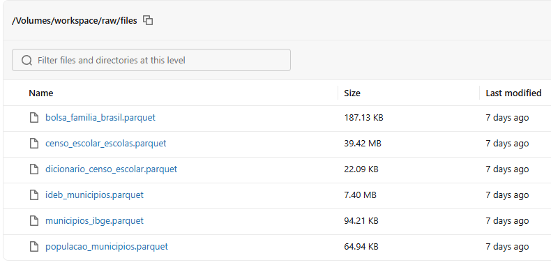
*Volume `workspace.raw.files` com os 6 arquivos gerados pela extração.*

---

## 3. Modelagem Dimensional e Catálogo de Dados

### Esquema Estrela

Modelagem dimensional via DDL formal com `NOT NULL`, constraints `CHECK` e constraints `PRIMARY KEY` / `FOREIGN KEY` informativas com a cláusula `RELY` para otimização de joins no Catalyst Optimizer. Os três fatos permanecem separados para evitar duplicação em grãos temporais e de agregação heterogêneos.

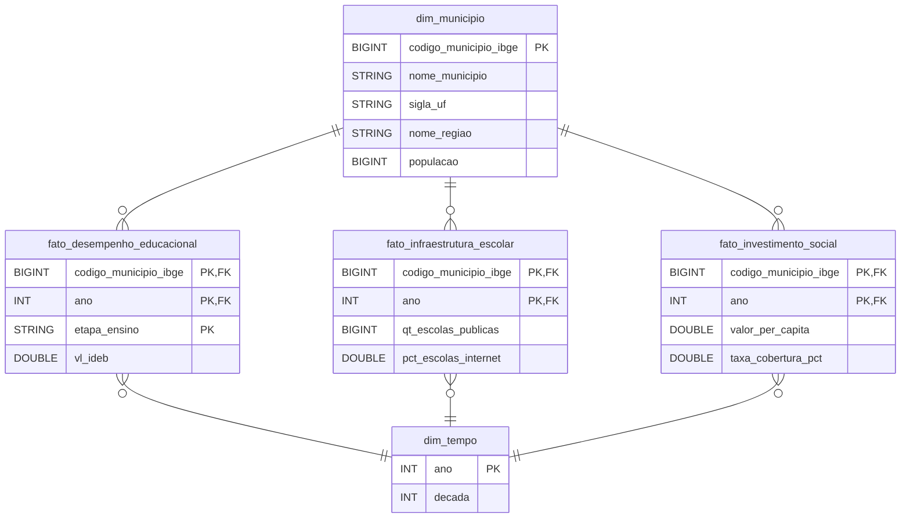

* **`dim_municipio`**: Chave `codigo_municipio_ibge` (PK), dados territoriais, UF, região e população residente do Censo 2022.
* **`dim_tempo`**: Chave `ano` (PK), indexando os anos cobertos pelas bases públicas.
* **`fato_desempenho_educacional`**: Chave composta `(codigo_municipio_ibge, ano, etapa_ensino)`. Métricas: nota do IDEB, proficiências do SAEB (Matemática e Português) e indicador de fluxo escolar.
* **`fato_infraestrutura_escolar`**: Chave composta `(codigo_municipio_ibge, ano)`. Métricas: percentuais municipais de escolas com internet, saneamento, energia, laboratórios, biblioteca e quadra, além de densidade de alunos por docente.
* **`fato_investimento_social`**: Chave composta `(codigo_municipio_ibge, ano)`. Métricas: repasse total do programa, benefícios emitidos, valor per capita e cobertura populacional.

### Governança no Unity Catalog

| Recurso | Escopo | Efeito Prático |
|---|---|---|
| Descrições em schemas, volumes, tabelas e colunas | Todas as camadas | Documentação acessível diretamente pelo Catalog Explorer |
| Metadados oficiais do INEP | Bronze e Silver | 408 colunas do Censo documentadas via dicionário oficial; 123 colunas do IDEB padronizadas |
| TBLPROPERTIES | Todas as camadas | Tags estruturais: `fonte`, `grao`, `atualizacao`, `origem` e filtros aplicados |
| TAGS | Todas as camadas | Rastreamento: `camada`, `fonte`, `dominio`, `dados_pessoais`, `papel`, `unidade` |
| `NOT NULL` e `CHECK` | Gold | Validação em runtime pelo Delta: gravações inválidas geram falha imediata |
| Constraints PK e FK com `RELY` | Gold | Documentação do grafo de integridade e eliminação de joins redundantes pelo Catalyst |
| Data Lineage | Todas as camadas | Grafo de linhagem rastreado automaticamente no metastore |

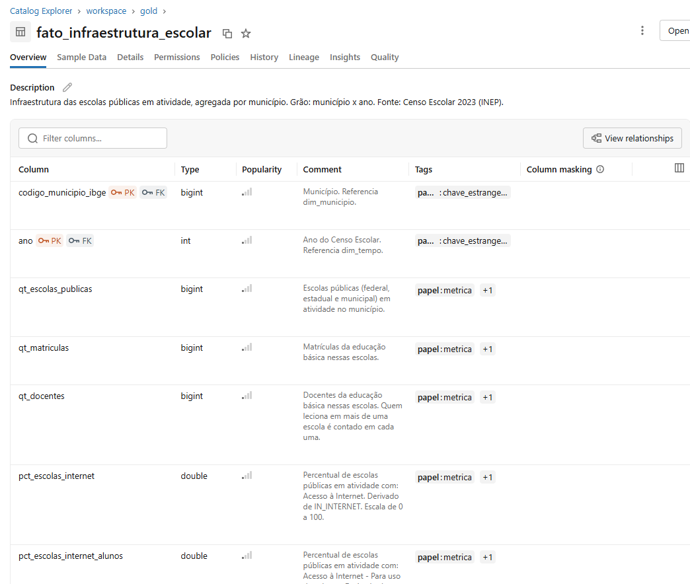
*`gold.fato_infraestrutura_escolar`: descrição, comentários vindos do dicionário do INEP, tags por coluna e chaves PK/FK.*

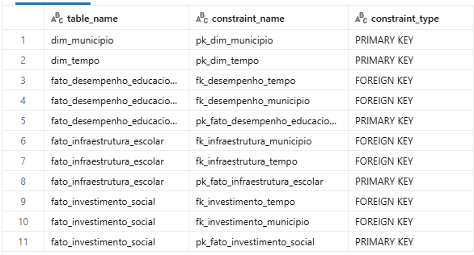
*Constraints das cinco tabelas Gold, consultadas no `information_schema`.*

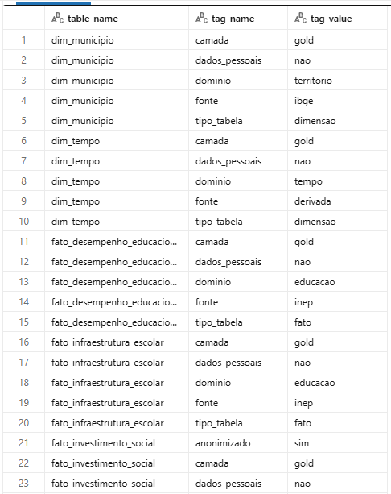
*Tags de governança aplicadas na criação das tabelas.*

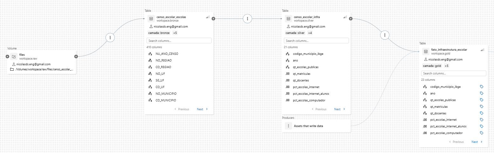
*Linhagem capturada automaticamente: Volume → Bronze → Silver → Gold.*

### Dicionário de Dados Gold

#### `gold.dim_municipio`
* **Linhagem:** API de Localidades + SIDRA 4714 (IBGE) → `bronze.municipios_ibge` + `bronze.populacao_municipios` → `silver.municipios` → `gold.dim_municipio` (5.571 linhas).

| Campo | Tipo | Nulo | Domínio | Descrição |
|---|---|---|---|---|
| `codigo_municipio_ibge` | BIGINT | Não | 7 dígitos | Código IBGE do município (PK) |
| `nome_municipio` | STRING | Não | Texto | Nome oficial do município |
| `sigla_uf` | STRING | Não | 27 UFs (CHECK) | Sigla da unidade da federação |
| `nome_regiao` | STRING | Não | Norte, Nordeste, Centro-Oeste, Sudeste, Sul (CHECK) | Região geográfica |
| `populacao` | BIGINT | Sim | > 0 (CHECK); de 833 a 11,4 milhões | População apurada no Censo 2022 (nulo apenas para município emancipado pós-Censo) |

#### `gold.dim_tempo`
* **Linhagem:** Anos distintos extraídos das camadas Silver (2 linhas: 2023 e 2024).

| Campo | Tipo | Nulo | Domínio | Descrição |
|---|---|---|---|---|
| `ano` | INT | Não | 2000 a 2100 (CHECK) | Ano de referência (PK) |
| `decada` | INT | Não | Múltiplos de 10 | Década do ano de referência |

#### `gold.fato_desempenho_educacional`
* **Linhagem:** Planilhas oficiais do IDEB → `bronze.ideb_municipios` (28.898 linhas) → `silver.ideb` (`REDE = 'Pública'`, colunas de 2023) → `gold.fato_desempenho_educacional` (11.134 linhas).

| Campo | Tipo | Nulo | Domínio | Descrição |
|---|---|---|---|---|
| `codigo_municipio_ibge` | BIGINT | Não | 7 dígitos | Município (FK para `dim_municipio`) |
| `ano` | INT | Não | 2023 | Ano da edição do IDEB (FK para `dim_tempo`) |
| `etapa_ensino` | STRING | Não | Anos Iniciais, Anos Finais (CHECK) | Etapa do ensino fundamental |
| `vl_ideb` | DOUBLE | Sim | 0 a 10 (CHECK); observado: 2,6 a 10 | IDEB observado |
| `vl_nota_matematica` | DOUBLE | Sim | 0 a 500 (CHECK); observado: 134 a 405 | Proficiência média SAEB em Matemática |
| `vl_nota_portugues` | DOUBLE | Sim | 0 a 500 (CHECK) | Proficiência média SAEB em Língua Portuguesa |
| `vl_indicador_rendimento` | DOUBLE | Sim | 0 a 1 (CHECK) | Indicador de fluxo escolar |

#### `gold.fato_infraestrutura_escolar`
* **Linhagem:** Microdados Censo Escolar 2023 → `bronze.censo_escolar_escolas` (217.625 escolas) → `silver.censo_escolar_infra` (escolas públicas ativas: 137.914; agregação por município) → `gold.fato_infraestrutura_escolar` (5.570 linhas).

| Campo | Tipo | Nulo | Domínio | Descrição |
|---|---|---|---|---|
| `codigo_municipio_ibge` | BIGINT | Não | 7 dígitos | Município (FK para `dim_municipio`) |
| `ano` | INT | Não | 2023 | Ano do Censo Escolar (FK para `dim_tempo`) |
| `qt_escolas_publicas` | BIGINT | Não | > 0 (CHECK) | Escolas públicas ativas no município |
| `qt_matriculas` | BIGINT | Sim | ≥ 0 | Total de matrículas na educação básica pública |
| `qt_docentes` | BIGINT | Sim | ≥ 0 | Total de docentes vinculados à rede pública |
| `pct_escolas_internet` | DOUBLE | Não | 0 a 100 (CHECK) | % de escolas com acesso à internet |
| `pct_escolas_internet_alunos` | DOUBLE | Não | 0 a 100 (CHECK) | % de escolas com internet para alunos |
| `pct_escolas_computador` | DOUBLE | Não | 0 a 100 (CHECK) | % de escolas com computadores |
| `pct_escolas_laboratorio_informatica` | DOUBLE | Não | 0 a 100 (CHECK) | % de escolas com laboratório de informática |
| `pct_escolas_biblioteca` | DOUBLE | Não | 0 a 100 (CHECK) | % de escolas com biblioteca ou sala de leitura |
| `pct_escolas_laboratorio_ciencias` | DOUBLE | Não | 0 a 100 (CHECK) | % de escolas com laboratório de ciências |
| `pct_escolas_quadra_esportes` | DOUBLE | Não | 0 a 100 (CHECK) | % de escolas com quadra esportiva |
| `pct_escolas_refeitorio` | DOUBLE | Não | 0 a 100 (CHECK) | % de escolas com refeitório |
| `pct_escolas_agua_potavel` | DOUBLE | Não | 0 a 100 (CHECK) | % de escolas com abastecimento de água potável |
| `pct_escolas_esgoto_rede_publica` | DOUBLE | Não | 0 a 100 (CHECK) | % de escolas com esgoto ligado à rede pública |
| `pct_escolas_energia_rede_publica` | DOUBLE | Não | 0 a 100 (CHECK) | % de escolas conectadas à rede elétrica |
| `pct_escolas_lixo_servico_coleta` | DOUBLE | Não | 0 a 100 (CHECK) | % de escolas com serviço de coleta de lixo |
| `pct_escolas_banheiro` | DOUBLE | Não | 0 a 100 (CHECK) | % de escolas com banheiro dentro do prédio |
| `pct_escolas_alimentacao` | DOUBLE | Não | 0 a 100 (CHECK) | % de escolas fornecendo alimentação escolar |
| `pct_escolas_acessibilidade_rampas` | DOUBLE | Não | 0 a 100 (CHECK) | % de escolas com rampas de acessibilidade |
| `pct_escolas_banheiro_pne` | DOUBLE | Não | 0 a 100 (CHECK) | % de escolas com banheiros adaptados para PCD |
| `media_alunos_por_escola` | DOUBLE | Sim | ≥ 0 (CHECK) | Matrículas ÷ escolas públicas ativas |
| `media_alunos_por_docente` | DOUBLE | Sim | ≥ 0 (CHECK); observado: 4,4 a 39,6 | Matrículas ÷ docentes |

#### `gold.fato_investimento_social`
* **Linhagem:** Microdados mensais da Transparência → agregação municipal externa → `bronze.bolsa_familia_municipio` → `silver.bolsa_familia` → `gold.fato_investimento_social` (5.570 linhas).

| Campo | Tipo | Nulo | Domínio | Descrição |
|---|---|---|---|---|
| `codigo_municipio_ibge` | BIGINT | Não | 7 dígitos | Município (FK para `dim_municipio`) |
| `ano` | INT | Não | 2024 | Ano da competência (FK para `dim_tempo`) |
| `mes_referencia` | STRING | Não | AAAAMM; 202405 | Mês de competência dos pagamentos |
| `valor_total` | DOUBLE | Não | ≥ 0 (CHECK) | Soma das parcelas pagas no mês (R$) |
| `quantidade_beneficiados` | BIGINT | Não | ≥ 0 (CHECK) | Quantidade de benefícios emitidos |
| `valor_per_capita` | DOUBLE | Sim | ≥ 0 (CHECK); observado: R$ 1,21 a R$ 335,75 | Repasse financeiro ÷ população residente |
| `taxa_cobertura_pct` | DOUBLE | Sim | 0 a 100 (CHECK); máximo: 51,2% | Benefícios pagos por 100 habitantes |

---

## 4. Pipeline de Dados e Orquestração

### Grafo de Execução (Databricks Workflows)

Orquestração definida em `scripts_auxiliares/mvp_pipeline_job.yml`:

1. **`setup_pipeline`**: Cria schemas com descrição e tags, cataloga o Volume e valida presença dos 6 Parquets na landing zone.
2. **`ingestion`**: Converte os arquivos Parquet para Delta Bronze com metadados de auditoria e validação de contagem com a origem.
3. **`transformation`**: Aplica regras de negócio, filtros de rede, casting seguro, verificação de chave única e materialização Silver.
4. **`modeling`**: Executa o DDL Gold com constraints e popula tabelas via `INSERT OVERWRITE`.
5. **`data_quality`** e **`analysis`**: Execução paralela após a modelagem. `data_quality` valida as 5 dimensões; `analysis` computa métricas, correlações e tabelas de negócio.

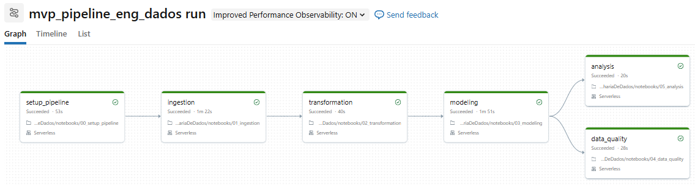
*As 6 tarefas concluídas em compute serverless; `data_quality` e `analysis` rodam em paralelo após a modelagem.*

### Camada Bronze (`workspace.bronze`)
* Metadados de rastreabilidade: `_ingestion_timestamp` (UTC) e `_ingestion_file` (URI de origem).
* Reconciliação automática: assert obrigatório comparando o count do Parquet de origem com a tabela Delta criada.

| Tabela | Volume de Registros |
|---|---:|
| `bronze.municipios_ibge` | 5.571 |
| `bronze.populacao_municipios` | 5.570 |
| `bronze.bolsa_familia_municipio` | 5.570 |
| `bronze.ideb_municipios` | 28.898 |
| `bronze.censo_escolar_escolas` | 217.625 |
| `bronze.dicionario_censo_escolar` | 458 |

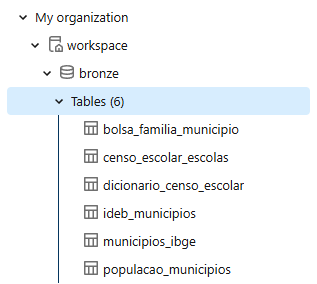
*As 6 tabelas persistidas em `workspace.bronze`.*

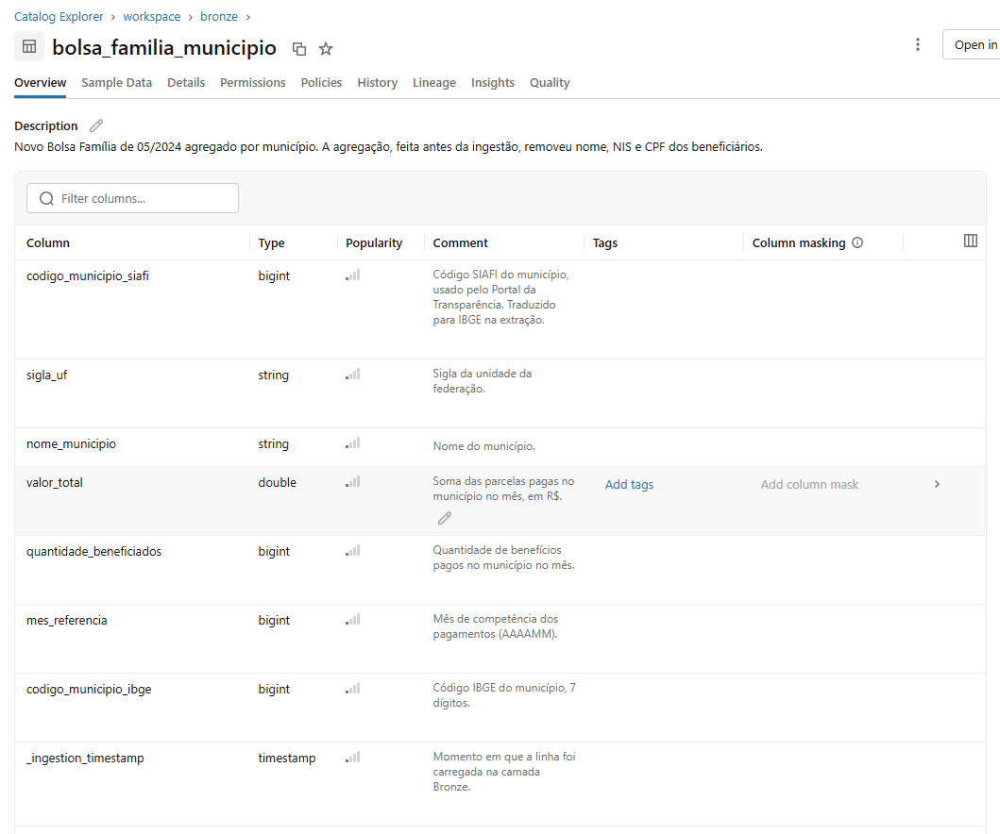
*`bronze.bolsa_familia_municipio`: a descrição registra a remoção de nome, NIS e CPF antes da ingestão, e as colunas de auditoria acompanham os dados.*

### Camada Silver (`workspace.silver`)

| Operação | Racional Técnico | Impacto nos Registros |
|---|---|---|
| **Filtro de escopo:** `REDE = 'Pública'` no IDEB | Isola a rede pública consolidada pelo INEP | 28.898 → 11.134 linhas |
| **Pivot/Seleção:** Colunas da edição 2023 | Reduz dimensionalidade da série histórica (2005-2023) | 123 → 7 colunas |
| **Filtro de escopo:** Escolas ativas (`TP_SITUACAO_FUNCIONAMENTO = 1`) e públicas (`TP_DEPENDENCIA IN (1, 2, 3)`) | Elimina escolas privadas, paralisadas ou extintas | 217.625 → 137.914 escolas |
| **Mudança de grão:** Escola → Município | Agregação por média simples entre escolas de indicadores binários `IN_*` convertidos em percentuais `pct_*` | 137.914 escolas → 5.570 municípios |
| **Enriquecimento:** Join com população Censo 2022 | Viabiliza o cálculo de taxas per capita na Gold | 5.571 municípios (1 sem população) |
| **Asserção de Unicidade:** Verificação de PK | Interrompe o pipeline se detectar duplicações oriundas de joins | 0 duplicações detectadas |

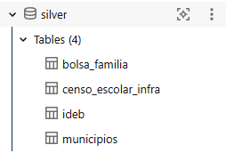
*As 4 tabelas persistidas em `workspace.silver`.*

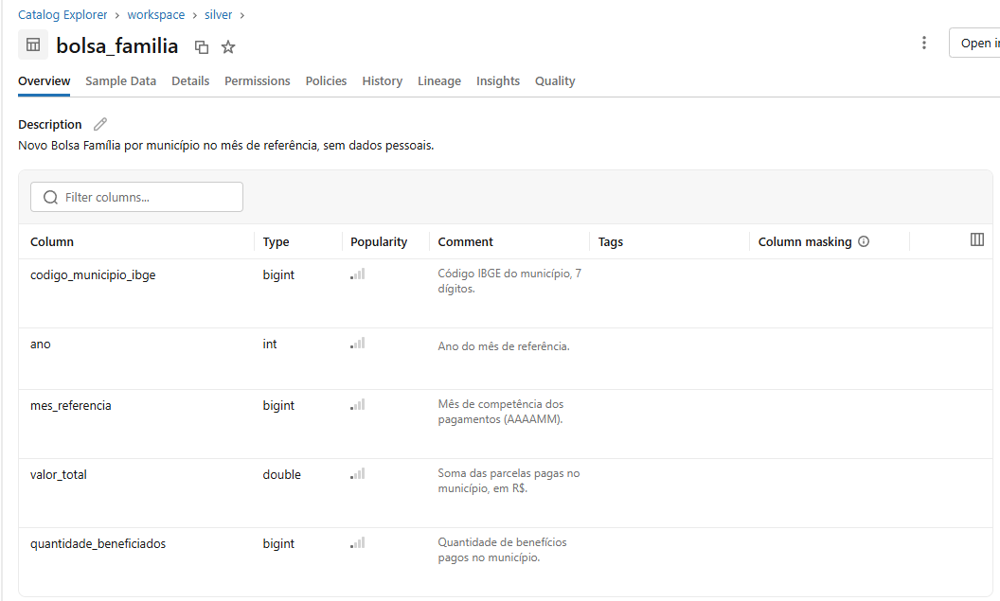
*`silver.bolsa_familia` com descrição da tabela e comentário por coluna.*

### Camada Gold (`workspace.gold`)
Materialização com DDL estrito, constraints ativas e integridade referencial validada (todas as chaves estrangeiras convergem para as dimensões sem registros órfãos).

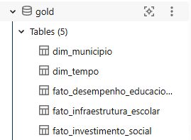
*As 5 tabelas do esquema estrela persistidas em `workspace.gold`.*

---

## 5. Auditoria de Qualidade de Dados (DAMA)

Validação automatizada implementada em `notebooks/04_data_quality.ipynb`:

| Dimensão | Regra Auditada | Resultado Obtido | Ação / Tratamento |
|---|---|---|---|
| **Completude** | Nulos em chaves primárias | 0% nulos em PKs | Bloqueio via `NOT NULL` nativo no Delta |
| **Completude** | Nulos nas notas do IDEB | 322 de 11.134 (2,9%): 136 Anos Iniciais, 186 Anos Finais | Legítimo: ausência de índice quando a taxa de participação no SAEB fica abaixo do mínimo estatístico |
| **Completude** | Nulos em população e contagens | 1 município sem população; 993 e 1.131 escolas sem matrículas/docentes | Mantidos. Boa Esperança do Norte (MT) foi emancipado após a coleta do Censo 2022 |
| **Consistência** | Siglas de UF | 100% aderentes às 27 UFs | Validado via `CHECK constraint` |
| **Consistência** | Escala de notas e percentuais | IDEB em [0, 10]; SAEB em [0, 500]; infra em [0, 100] | Validado via `CHECK constraint` |
| **Unicidade** | Chaves primárias das tabelas Gold | 0 duplicatas | Validado via asserções explícitas (`assert`) |
| **Acurácia** | Integridade referencial Fatos → Dimensões | 100% de integridade | 0 chaves órfãs nas 3 tabelas fato |
| **Acurácia** | Reconciliação financeira Bronze vs Gold | R$ 0,00 de divergência | Reconciliação exata de somatório de parcelas e benefícios |
| **Outliers** | IQR sobre repasses per capita | 3 municípios com valores atípicos: Serrano do Maranhão (R$ 335,75), Pedrinhas (R$ 263,15), Pracuúba (R$ 261,07) | Mantidos: municípios de baixa população com extrema vulnerabilidade social |

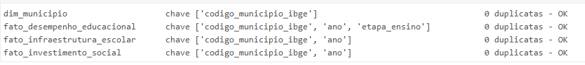
*Unicidade: nenhuma chave repetida nas quatro tabelas auditadas.*

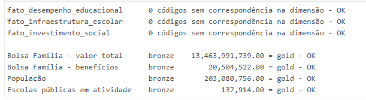
*Acurácia: nenhum código órfão nos fatos, e totais idênticos entre Bronze e Gold.*

---

## 6. Resultados Analíticos

Consultas executadas em `notebooks/05_analysis.ipynb`. A tabela analítica consolida os três fatos pela dimensão municipal, utilizando o IDEB dos **Anos Finais da rede pública** (5.382 municípios com notas válidas; média nacional: **4,77**).

### Pergunta 1: Municípios com mais Bolsa Família per capita têm IDEB maior ou menor?

**Menor.** A correlação de Pearson entre repasse per capita e IDEB é **−0,49**, evidenciando comportamento monotônico decrescente por quartil de repasse:

| Quartil de Bolsa Família per capita | Municípios | R$ per capita (Média) | IDEB Médio | População Média |
|---|---:|---:|---:|---:|
| Q1 (Menor repasse) | 1.346 | 25,32 | **5,23** | 55.261 |
| Q2 | 1.346 | 54,93 | 4,96 | 41.223 |
| Q3 | 1.344 | 101,85 | 4,58 | 36.562 |
| Q4 (Maior repasse) | 1.346 | 155,67 | **4,30** | 16.950 |

A população média cai de 55 mil (Q1) para 17 mil (Q4): os grandes centros urbanos se concentram nos quartis de menor repasse per capita. O porte, porém, não explica o gradiente do IDEB: a correlação entre população e IDEB é praticamente nula.

**Interpretação:** A correlação negativa reflete a focalização do programa social em populações de baixa renda. O repasse atua como marcador de vulnerabilidade socioeconômica estrutural, não representando efeito causal negativo do benefício sobre a aprendizagem.

### Pergunta 2: Escolas com melhor infraestrutura física têm melhor desempenho?

**Sim, com intensidade moderada.** Todos os indicadores físicos avaliados apresentam correlação positiva com a nota do IDEB:

| Indicador Físico | Correlação com o IDEB |
|---|---:|
| % escolas com quadra de esportes | +0,39 |
| % escolas com laboratório de informática | +0,37 |
| % escolas com internet | +0,32 |
| % escolas com refeitório | +0,30 |
| % escolas com laboratório de ciências | +0,28 |
| % escolas com água potável | +0,23 |
| % escolas com biblioteca | +0,22 |
| % escolas com rede pública de esgoto | +0,22 |
| % escolas com rampas de acessibilidade | +0,18 |
| Densidade: alunos por docente | −0,22 |


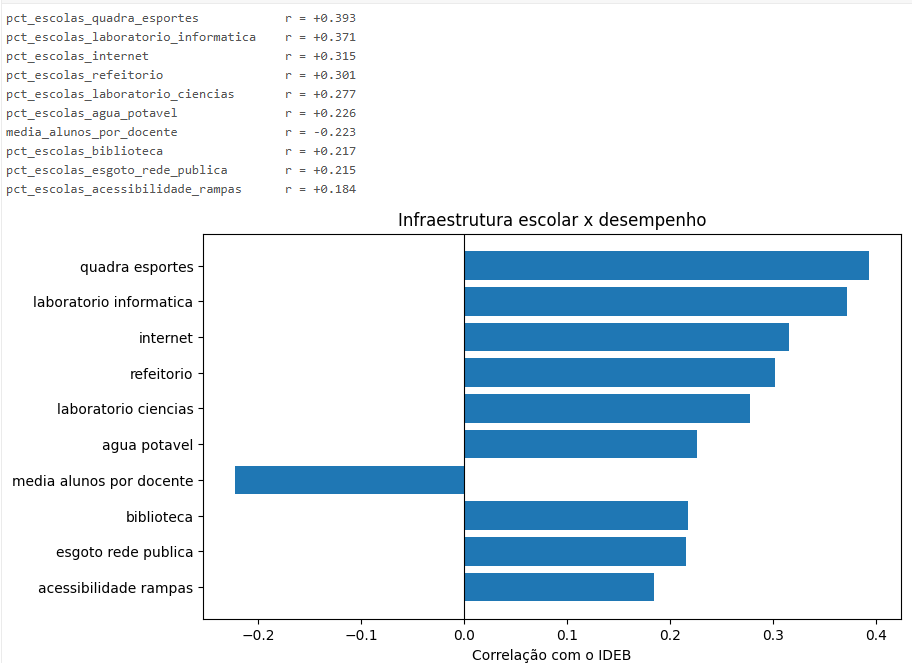
*Correlação de cada indicador de infraestrutura com o IDEB dos Anos Finais.*


**Interpretação:** A infraestrutura física opera como condição necessária, porém não suficiente: nenhum indicador isolado supera correlação de +0,40. Os insumos com maior impacto correlacional (quadras, laboratórios de informática e internet) são justamente aqueles com maior disparidade regional.

### Pergunta 3: Qual a relação global entre investimento e desempenho?

Verifica-se associação com sinais divergentes: repasses assistenciais per capita correlacionam-se negativamente (−0,49), enquanto indicadores de infraestrutura escolar correlacionam-se positivamente (+0,20 a +0,39). Variáveis de escala do município não apresentam relação linear com o IDEB (população total: +0,003; total de escolas: −0,06).

### Pergunta 4: Como essas relações variam entre macrorregiões e estados?

| Macrorregião | Municípios | IDEB Médio | BF per capita | % Escolas c/ Internet | % Escolas c/ Lab. Info | Correlação BF × IDEB |
|---|---:|---:|---:|---:|---:|---:|
| Sul | 1.111 | 5,15 | R$ 35 | 99,1% | 44,4% | −0,28 |
| Centro-Oeste | 453 | 5,09 | R$ 64 | 98,6% | 42,5% | −0,10 |
| Sudeste | 1.622 | 4,93 | R$ 57 | 95,3% | 42,4% | −0,46 |
| Nordeste | 1.758 | 4,41 | R$ 138 | 89,1% | 17,9% | −0,13 |
| Norte | 438 | 4,28 | R$ 115 | 76,9% | 16,6% | −0,52 |

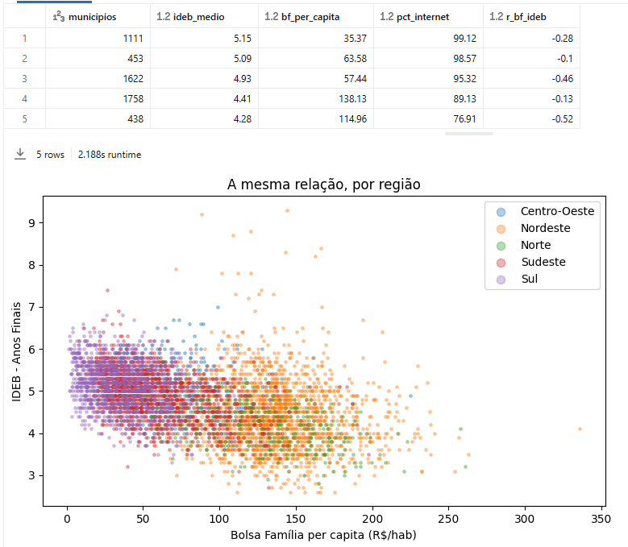
*IDEB médio, Bolsa Família per capita, cobertura de internet e correlação calculada dentro de cada região.*

Extremos estaduais no IDEB: Ceará (5,55), Goiás (5,45) e Paraná (5,43) lideram; Roraima (3,82), Rio Grande do Norte (3,84) e Amapá (3,88) registram as menores médias.

**Interpretação:** As regiões Norte e Nordeste concentram os maiores índices de repasse assistencial per capita, o menor investimento relativo em infraestrutura (menos da metade das escolas possuem laboratórios em comparação ao Sul) e médias de desempenho mais baixas. Contudo, a variância da correlação intra-regional (ex: −0,52 no Norte vs −0,13 no Nordeste) demonstra que as diferenças socioeconômicas operam de forma assimétrica em cada território. O caso do Ceará (líder nacional em IDEB, apesar de inserido no contexto regional do Nordeste) evidencia o impacto de políticas educacionais e governança local mitigando determinantes socioeconômicos.

---

## 7. Limitações Técnicas e Próximos Passos

### Débitos Técnicos e Limitações Conhecidas
* **Bloqueio de Egress no Databricks Free Edition:** Necessidade de rodar o download e descompactação localmente antes de alimentar o Volume.
* **Cobertura Temporal Restrita:** Ingestão de um mês de referência para o Bolsa Família e recorte da edição de 2023 do IDEB (série 2005-2023 arquivada sem cruzamento longitudinal).
* **Ausência da Fonte de Repasses Escolares:** O PDDE (FNDE) não foi incluído, limitando a análise financeira escolar a proxies de infraestrutura física.
* **Análise Observacional:** Correlações quantitativas não isolam causalidade sem regressões controladas e modelos de efeitos fixos municipais.

### Backlog Técnico
* Migração da extração inicial para jobs serverless em nuvem assim que houver conectividade liberada.
* Em ambiente de nuvem produtivo (S3/ADLS/GCS), a landing zone adotaria particionamento físico por data de extração (`date=YYYY-MM-DD` ou `ano=/mes=`) para suportar ingestões incrementais, histórico de cargas e backfills idempotentes sem necessidade de sobrescrita total.
* Modelagem de tabela fato longitudinal integrando toda a série histórica do IDEB (2005 a 2023).
* Automação de ingestão incremental de dados do Bolsa Família via streaming com Delta Live Tables (DLT).
* Integração de dados de repasses financeiros escolares via API do FNDE/Siope.

---

## 8. Instruções de Execução

### Pré-requisitos
* Python 3.10+
* Pacotes: `pandas`, `requests`, `pyarrow`, `openpyxl`, `truststore`
* Databricks Workspace com Unity Catalog ativado

### 1. Extração Local
```bash
python -m pip install pandas requests pyarrow openpyxl truststore
python scripts_auxiliares/extrair_dados.py
```
O script gera os artefatos Parquet no diretório `data/`. Faça o upload dos arquivos para o volume `/Volumes/workspace/raw/files`.

### 2. Execução do Job no Databricks
1. Clone o repositório como **Git Folder** no Databricks.
2. Em **Jobs & Pipelines → Create Job**, selecione **Edit as YAML** e aplique a configuração de `scripts_auxiliares/mvp_pipeline_job.yml` com os caminhos do workspace ajustados.
3. Dispare a execução manual via **Run Now** ou execute os notebooks sequencialmente: `00_setup_pipeline` → `01_ingestion` → `02_transformation` → `03_modeling` → `04_data_quality` e `05_analysis`.
